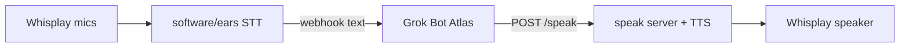

# Desk Atlas

Physical **Grok Bot** screen buddy for a desk: Orange Pi Zero 2W + PiSugar Whisplay HAT.

You talk → mic → STT → webhook into Atlas → Atlas replies out loud through TTS on the device.

## Hardware

| Piece | Notes |
|-------|--------|
| Orange Pi Zero 2W (2GB) | Board |
| PiSugar Whisplay HAT | 1.69″ LCD, dual mics, speaker, RGB, button |
| 40-pin hammer-in header | Stack interconnect |
| microSD + 5V USB-C PSU | Bookworm server image |
| M2.5×8 mm screws | Case (clamshell, not snap) |

Custom case STL/OpenSCAD: [`hardware/case/`](hardware/case/) (also mirrored in Google Drive).

## Architecture

## Quick start

1. Flash Bookworm server on the Zero 2W (see [`docs/FLASH-WHEN-BOARD-ARRIVES.md`](docs/FLASH-WHEN-BOARD-ARRIVES.md) and [`phase2/`](phase2/)).
2. Copy `config/config.example.json` → local `config.json` (never commit secrets).
3. Put `XAI_API_KEY`, `ATLAS_WEBHOOK_URL`, and `ATLAS_SENDER_KEY` in a local `.env` on the Pi.
4. Run ears: `python3 software/ears/ears.py --seconds 4`
5. Expose speak via named Cloudflare tunnel (example: `https://desk.etjarvis.com/speak`). Atlas POSTs `{"text":"…","closer":true}`.

## Repo layout

| Path | What |
|------|------|
| `software/ears/` | Record → xAI STT → voice-in webhook |
| `software/speak/` | TTS speak HTTP server |
| `hardware/case/` | OpenSCAD + dims (+ STLs when present) |
| `deploy/` | systemd units + cloudflared examples |
| `docs/` | Flash, tunnel, blockers, phase 0 |
| `phase2/` | Pi install package + checklists |
| `config/` | `*.example` only |

## Security

**Do not commit:** `.env`, `speak.secret`, webhook sender keys, API keys, live tunnel credential JSON.

Examples and docs stay key-free. Production speak URL for Ethan’s desk is a named tunnel; treat the **secret header / API keys** as private even when the hostname is public.

## Status

Phase 0 ears/mouth proven. Hardware purchased. Phase 2: flash Pi, wire STT + speak on-device, keep secrets local.

Owners (personal ops): Hermes (software), Daedalus (hardware), Atlas (PM / webhook), Octavian (this GitHub repo).

## License

MIT — see [`LICENSE`](LICENSE).
